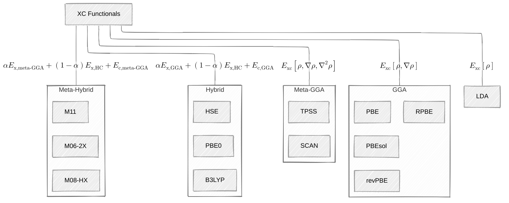

# Density Functional Theory

## Electron Exchange-Correlation Energy Density Functionals (XC Functionals)

```mermaid
---
config:
  theme: neutral
  look: handDrawn
  layout: elk
---
flowchart TD

  subgraph C[GGA]
    direction LR
    G[PBE]
    H[revPBE]
    I[RPBE]
    J[PBEsol]
  end

  subgraph D[Meta-GGA]
    direction LR
    K[TPSS]
    L[SCAN]
  end

  subgraph E[Hybrid]
    direction LR
    M[B3LYP]
    N[PBE0]
    O[HSE]
  end

  subgraph F[Meta-Hybrid]
    direction LR
      P[M06-2X]
      Q[M08-HX]
      R[M11]
  end

  A[XC Functionals]
  B[LDA]

  A-- "$$E_\text{xc}\left[\rho\right]$$" ---B
  A-- "$$E_\text{xc}\left[\rho,\nabla\rho\right]$$" ---C
  A-- "$$E_\text{xc}\left[\rho,\nabla\rho,\nabla^2\rho\right]$$" ---D
  A-- "$$\alpha E_\text{x,GGA}+\left(1-\alpha\right)E_\text{x,HC}+E_\text{c,GGA}$$" ---E
  A-- "$$\alpha E_\text{x,meta-GGA}+\left(1-\alpha\right)E_\text{x,HC}+E_\text{c,meta-GGA}$$" ---F
```


